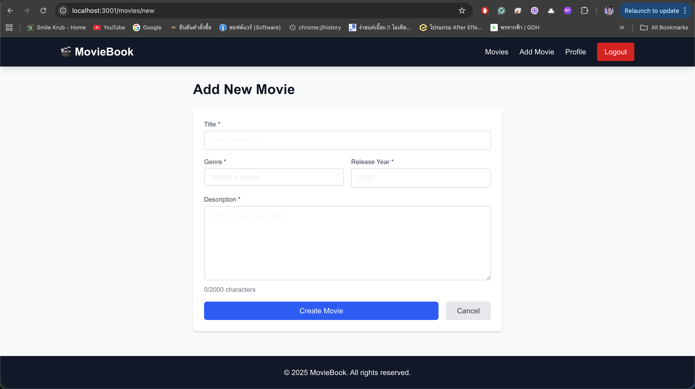

# MovieBook

A movie review platform where users can browse movies, write reviews, and manage their profiles.

## Team Member

**Chartinai Nipatvaranan** - [GitHub](https://github.com/NotingCap)

## Project Description

MovieBook is a full-stack web application built with Next.js 15 and MongoDB Atlas that allows users to:

- **Browse Movies**: View a collection of movies with detailed information
- **Write Reviews**: Share opinions and rate movies from 1 to 5 stars
- **Search & Filter**: Find movies by title, genre, or release year
- **User Profiles**: Track your reviews and see statistics
- **Authentication**: Secure user registration and login system

### Technologies Used

- **Frontend**: Next.js 15 (App Router), React 19, Tailwind CSS 4
- **Backend**: Next.js API Routes, TypeScript
- **Database**: MongoDB Atlas (Cloud)
- **Authentication**: iron-session

## Screenshots

### Home Page

*Browse all movies with search and filter functionality*

### Movie Detail Page

*View movie information and all reviews*

### Write Review

*Rate and review movies with interactive star rating*

### User Profile

*View user statistics and all their reviews*

### Login Page

*Secure user authentication*

### Register Page

*Create a new account*

### Add Movie Page

*Add new movies to the platform*

### Edit Movie Page

*Update movie information*

## Setup Instructions

1. Clone the repository
```bash
git clone https://github.com/NotingCap/MovieBook.git
cd MovieBook/moviebook
```

2. Install dependencies
```bash
npm install
```

3. Configure environment variables
Create a `.env.local` file (use `.env.example` as template):
```env
MONGODB_URI=your_mongodb_atlas_connection_string
SESSION_SECRET=your_secret_key_min_32_characters
NEXT_PUBLIC_APP_URL=http://localhost:3000
```

4. Run the development server
```bash
npm run dev
```

5. Open [http://localhost:3000](http://localhost:3000) in your browser

## Features

- ✅ Full CRUD operations for movies, reviews, and users
- ✅ Session-based authentication
- ✅ Real-time search functionality
- ✅ Genre and year filtering
- ✅ Average rating calculation
- ✅ Responsive design
- ✅ Form validation
- ✅ Protected routes

## API Endpoints

### Authentication
- `POST /api/auth/register` - Register new user
- `POST /api/auth/login` - Login user
- `POST /api/auth/logout` - Logout user
- `GET /api/auth/me` - Get current user

### Movies
- `GET /api/movies` - Get all movies (with search/filter)
- `GET /api/movies/[id]` - Get movie by ID
- `POST /api/movies` - Create movie
- `PUT /api/movies/[id]` - Update movie
- `DELETE /api/movies/[id]` - Delete movie

### Reviews
- `GET /api/reviews/movie/[movieId]` - Get reviews for a movie
- `GET /api/reviews/user/[userId]` - Get reviews by user
- `POST /api/reviews` - Create review
- `PUT /api/reviews/[id]` - Update review
- `DELETE /api/reviews/[id]` - Delete review

### Users
- `GET /api/users/[id]` - Get user profile
- `PUT /api/users/[id]` - Update profile
- `DELETE /api/users/[id]` - Delete account

## Database Schema

### Movie
- title (String)
- genre (Enum)
- releaseYear (Number)
- description (String)

### User
- name (String)
- email (String, unique)
- password (String)

### Review
- userId (ObjectId → User)
- movieId (ObjectId → Movie)
- rating (Number, 1-5)
- comment (String)

## Project Structure

```
moviebook/
├── app/
│   ├── api/              # API routes
│   ├── movies/           # Movie pages
│   ├── profile/          # Profile pages
│   ├── login/            # Login page
│   └── register/         # Register page
├── components/           # React components
├── context/              # Auth context
├── lib/                  # Utilities
├── models/               # Database models
└── .env.local            # Environment variables
```

## License

Created for educational purposes as part of Web Application Development coursework.
